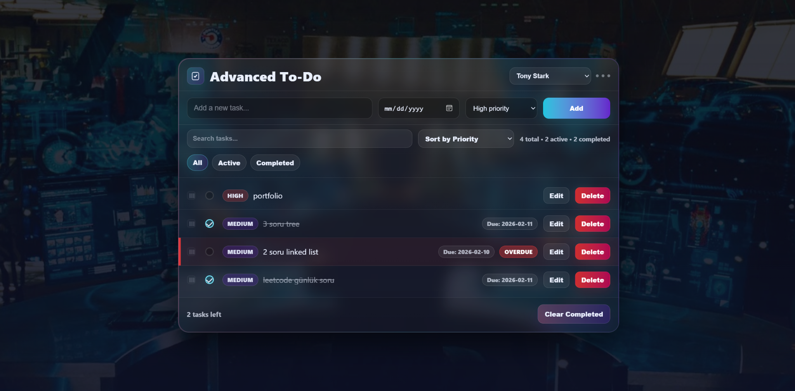

  

<h1 align="center">Advanced Todo List</h1>

A modern, fully client-side **Todo List application** built to demonstrate strong frontend fundamentals using **HTML, CSS, and Vanilla JavaScript**.

The project focuses on clean state management, rich UI interactions, and maintainable code structure — without relying on frameworks or external libraries.

---

## ✨ Features

- Add, edit, delete tasks
- Mark tasks as completed / active
- **Priority levels** (High / Medium / Low)
- **Due dates** with automatic **overdue detection**
- Inline task editing
- **Drag & drop reordering** (manual mode)
- Search tasks by text
- Sort by priority, due date, or manual order
- Task counters (total / active / completed)
- Clear completed tasks
- Persistent storage using `localStorage`
- Empty state handling
- Multiple themes with persistent selection

---

## 🎨 Themes

- Dark
- Light (White)
- Neon
- Tony Stark (default)

Selected theme is saved in `localStorage` and restored on reload.

---

## 🧱 Tech Stack

This project is a **pure frontend application** built with:

- **HTML** for semantic structure  
- **CSS** for layout, theming, and visual design  
- **Vanilla JavaScript** for:
  - State management
  - DOM manipulation
  - Event handling
  - Drag & drop logic
  - Persistent storage

No frameworks, libraries, or build tools are used.

---

## 🧠 Architecture & Design Decisions

- Single source of truth (`tasks` array)
- Explicit state → render cycle
- Small helper functions for readability
- Manual drag enabled only when sorting mode allows it
- UUID-based task IDs using `crypto.randomUUID()`
- Defensive parsing when loading from storage
- Clear separation between:
  - State mutations
  - Rendering
  - UI bindings

---

## 🤝 AI Assistance Disclosure

Theming and overall design decisions were made by the author.

AI tools were used to assist with CSS implementation and UI-related interactions such as drag & drop.

All application logic, state management, refactoring decisions, and final integration were fully implemented by the author.

---
